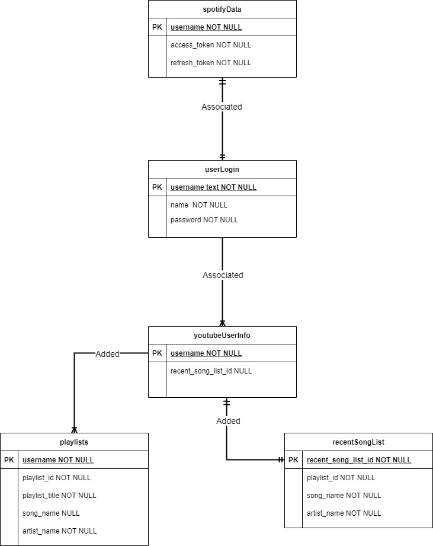

# Assignment 3
[Github Link to Project](https://github.com/UIC-CS484/assignment-2---final-project-repository-team6)

## Running the Project
----------------------
## Please use: ```yarn install``` to install all packages before testing. You may need to run the command in both the ```/frontend``` and ```/backend``` folders.
## To run the project please use ```yarn start``` in the ```/frontend``` and ```/backend``` folder at the same time.


## Member Names:
-----------------
Jacob Raffe 
> (jraffe2) @jakeraffe

Josh Dudly
> (jdudle4) @dudley2y


## Testing: 
----------------------------------------------------
### Step 1: => Navigate to the ```/frontend``` folder 
### Step 2: ```yarn test```
1. Get basic tests to pass. Create a test that should pass and one that should fail such as 
```jest 
expect(false).toBe(false)
```

2. Create a simple test for visual page layout. Expecting a pages headers or text to actually appear on the page.

3. Begin work on the backend funcionality testing (most important part of the app by far). Research how to test api calls between the frontend and backend and how to get response data.

4. Test database inputs and changes to ensure stability of the database. Test user input into database and authenticate input.


## Requirement 1: ER Diagram
------------------------------


## Requirement 3: (RESTFul API )
---------------------------------
The current form of the project allows users to search and listen to songs via the spotify API.

## Requirement 4: (Front-end Data Manipulation)
-----------------------------------------------
This requirement was filled by showing a users chart of recently played songs.


**Tools and resources:**

[VSCode](https://code.visualstudio.com/)
[LiveServer](https://marketplace.visualstudio.com/items?itemName=ritwickdey.LiveServer)
[HTML CSS Support](https://marketplace.visualstudio.com/items?itemName=ecmel.vscode-html-css)
[Jest Documentation](https://jestjs.io/docs/getting-started)
[Express testing with Jest](https://www.codementor.io/@knownasilya/testing-express-apis-with-supertest-du107mcv2)
[Supertest for jest API](https://www.npmjs.com/package/supertest)
[Semantic UI](https://semantic-ui.com/)

